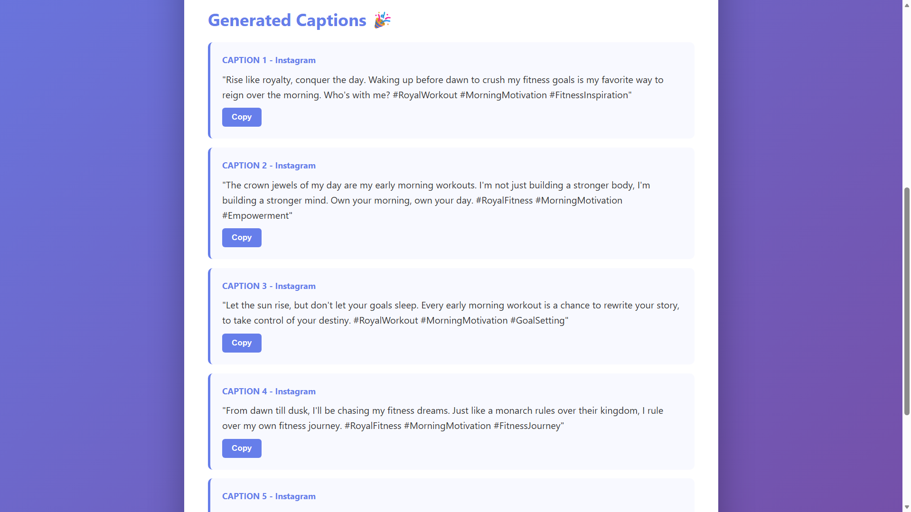
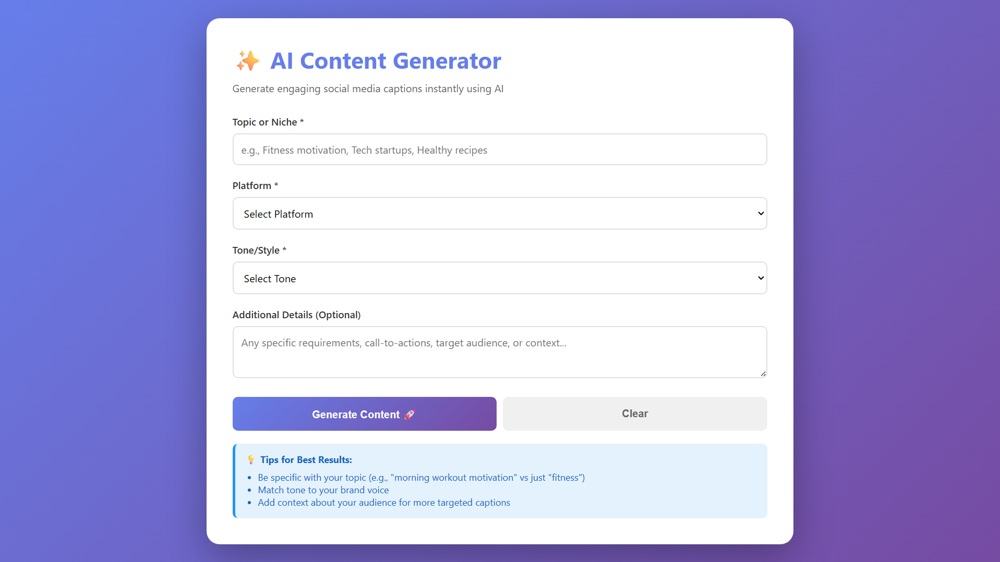
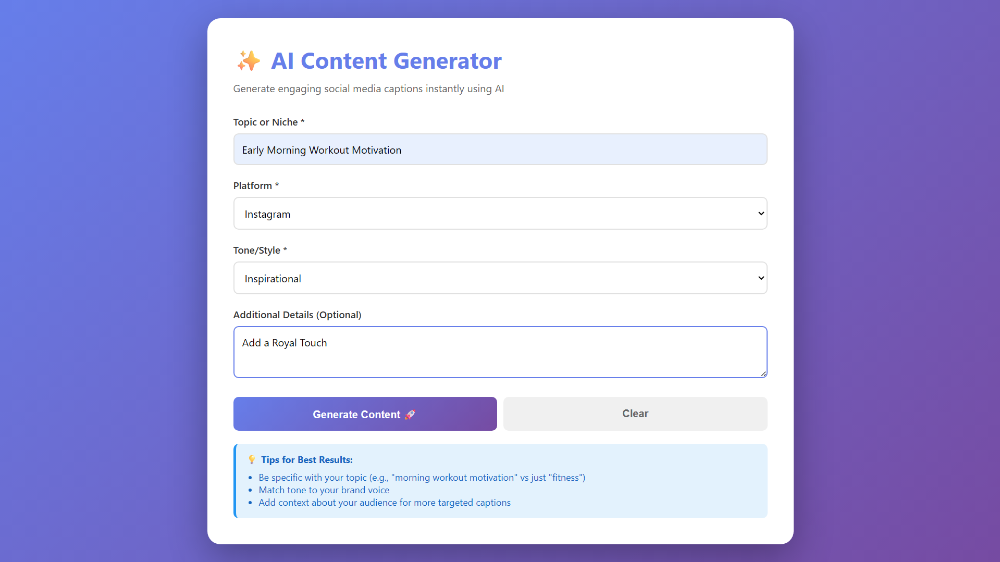

# 🚀 AI Social Media Content Generator

An intelligent web application that generates engaging social media captions using HuggingFace's Llama 3.2 AI model. Built to help content creators, marketers, and businesses create compelling content instantly.



## ✨ Features

- **🤖 AI-Powered Generation** - Uses Meta's Llama 3.2-3B-Instruct via HuggingFace
- **📱 Multi-Platform Support** - Instagram, LinkedIn, Twitter/X, Facebook, TikTok
- **🎨 Tone Customization** - Professional, casual, inspirational, humorous, educational, promotional
- **⚡ Instant Results** - Get 5 unique caption variations in seconds
- **📋 One-Click Copy** - Easy clipboard integration
- **🎯 Context-Aware** - Add specific requirements for targeted captions
- **🔒 Secure** - API token hidden via serverless architecture
- **📱 Responsive Design** - Works seamlessly on desktop and mobile
- **100% Free** - No API key required for users

## 🎯 Live Demo

**[Try it Live →](https://ai-social-content-generator-fatikimran.vercel.app)**

> No signup needed - just fill the form and generate content instantly!

## 💡 Use Cases

- Content creators planning social media calendars
- Marketing teams batch-creating campaign content
- Small businesses needing quick, professional captions
- Influencers maintaining consistent posting schedules
- Students learning about AI and prompt engineering

## 🛠️ Technologies Used

### Frontend
- **HTML5, CSS3, Vanilla JavaScript** - Clean, framework-free implementation
- **Responsive Design** - Mobile-first approach
- **CSS Animations** - Smooth transitions and loading states

### Backend
- **Vercel Serverless Functions** - Secure API token handling
- **Node.js Runtime** - Fast, efficient processing

### AI Integration
- **HuggingFace Router API** - OpenAI-compatible inference endpoint
- **Meta Llama 3.2-3B-Instruct** - State-of-the-art language model
- **Prompt Engineering** - Optimized prompts for consistent outputs

### Deployment
- **Vercel** - Automatic deployments from GitHub
- **Environment Variables** - Secure token storage
- **HTTPS** - Automatic SSL certificates

## 📸 Screenshots

### Clean Interface


### Input Form


### Generated Results


## 🎓 Technical Highlights

### Secure Architecture
- API token stored as environment variable (never exposed to client)
- Serverless function acts as secure proxy
- CORS-compliant API design

### Prompt Engineering
The app uses structured prompts that:
- Specify exact number of outputs (5 captions)
- Define platform-appropriate length and style
- Include tone instructions for consistent voice
- Request relevant hashtags
- Format responses for reliable parsing

### Error Handling
- Validation of user inputs
- API timeout management
- Graceful error messages
- Loading states for better UX

## 💻 Local Development
```bash
# Clone the repository
git clone https://github.com/FatikImran/ai-social-content-generator.git

# Navigate to directory
cd ai-social-content-generator

# Install Vercel CLI (if not already installed)
npm install -g vercel

# Set up environment variable
# Create .env file with:
# HUGGINGFACE_API_TOKEN=your_token_here

# Run locally
vercel dev
```

## 📁 Project Structure
```
ai-social-content-generator/
├── index.html          # Frontend interface
├── api/
│   └── generate.js     # Serverless function (secure API proxy)
├── vercel.json         # Vercel configuration
└── README.md
```

## 🔒 Privacy & Security

- ✅ API tokens stored securely in Vercel environment variables
- ✅ No user data collected or stored
- ✅ All processing happens server-side
- ✅ HTTPS encryption for all requests
- ✅ No third-party tracking or analytics

## 🌟 What I Learned

Building this project taught me:

- **Serverless Architecture** - Implementing secure backend functions without managing servers
- **API Integration** - Working with modern AI APIs and handling async operations
- **Prompt Engineering** - Crafting effective prompts for consistent AI outputs
- **Security Best Practices** - Hiding API keys and securing backend endpoints
- **User Experience Design** - Creating intuitive interfaces for AI tools
- **Error Handling** - Managing API rate limits, timeouts, and edge cases
- **Modern Deployment** - CI/CD with Vercel and GitHub integration

## 🚀 Future Enhancements

- [ ] Multi-language support for international content
- [ ] Save favorite captions to browser localStorage
- [ ] Export captions to CSV/PDF
- [ ] Character count per platform
- [ ] Hashtag research and suggestions
- [ ] Image caption generation (multimodal AI)
- [ ] A/B testing recommendations
- [ ] Integration with social media scheduling tools
- [ ] User accounts and caption history

## 🤝 Contributing

Feedback and suggestions welcome! Feel free to:
- ⭐ Star the repo if you find it useful
- 🐛 Open an issue for bugs
- 💡 Submit feature requests
- 🔧 Create pull requests for improvements

## 📄 License

Free to use for personal and commercial projects.

## 👤 Author

**Muhammad Fatik Bin Imran**

- 💼 Portfolio: [fatikimran.github.io](https://fatikimran.github.io)
- 💻 GitHub: [@FatikImran](https://github.com/FatikImran)
- 📧 Email: fatikimran@gmail.com

---

**Project Timeline:** December 2024

*Built as part of my AI development portfolio to demonstrate practical application of large language models, serverless architecture, API integration, and modern web development practices.*

**Tech Stack:** HTML/CSS/JS • Vercel • HuggingFace • Llama 3.2 • Serverless Functions
